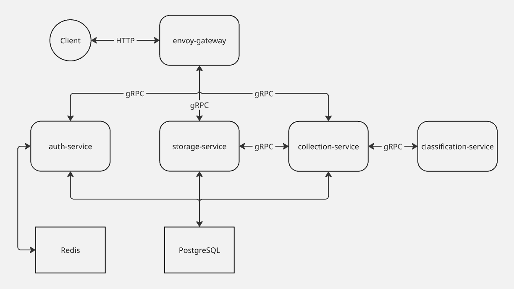

# Coinflow Server

**Coinflow** – это приложение, которое помогает с удобством вести учет своих денежных доходов и расходов, а также собирает информативную статистику и помогает спланировать будущие траты.  
В данном репозитории содержится серверная часть данного приложения, разделенная на отдельные микросервисы и объединенная под API Gateway, проксирующим трафик.


## Используемые технологии

* Go
* Python
* gRPC
* PostgreSQL
* Redis
* Gin
* Envoy
* Docker

## API

Детальное описание API можно найти [здесь](docs/API.md).  
По умолчанию для клиентских запросов прослушивается порт 8080. Изменить его можно в [файле конфигурации Envoy](envoy/envoy-gateway.yaml): ```static_resources.listeners[0].address.socket_address.port_value```

## Запуск

Сборка всех сервисов и их развертывание через Docker Compose:

```bash
make launch_services
```

Сборка всех сервисов, их развертывание через Docker Compose и запуск интеграционных тестов:

```bash
make launch_services_with_tests
```

Остановка всех сервисов и удаление контейнеров:

```bash
make stop_services
```

## Архитектура сервера

* **envoy-gateway** – Envoy Proxy в качестве API Gateway, проксирующий запросы и предоставляющий клиенту единый набор эндпойнтов для взаимодействия с сервером.
* **auth-service** – сервис для пользовательской авторизации/аутентификации.
* **storage-service** – сервис для прямого взаимодействия с операциями (добавление/получение).
* **collection-service** – сервис для получения статистики об операциях пользователя.
* **classification-service** – сервис на Python, используемый для классификации текста (распознавания категории операции).

Данные о пользователях и операциях хранятся в PostgreSQL.  
Для кэширования используется Redis (например, для добавления использованных refresh токенов в черный список).



## Конфигурация

Описана [здесь](docs/CONFIG.md).
